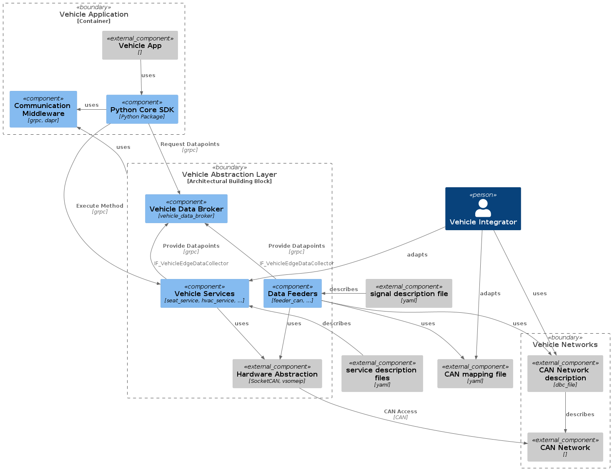
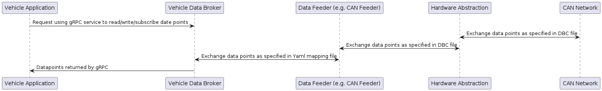
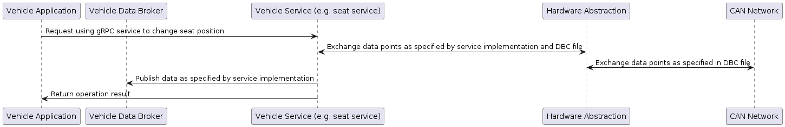

# Vehicle Abstraction Layer - KUKSA.VAL
## Introduction

The **KUKSA.VAL** provided by the [Eclipse KUKSA project](https://www.eclipse.org/kuksa/) is a reference implementation of a **Vehicle Abstraction Layer (VAL)**.
It offers **Vehicle Applications**, downloadable from or even runnable in the cloud, to interact with the underlying vehicle hardware and software in a unifom way - independent of model, make or even manufacturer.

This independency is gained by supporting standarized data models and service catalogs like the [COVESA Vehicle Signal Specification (VSS)](https://covesa.github.io/vehicle_signal_specification/) and
the [Vehicle Service Catalog (VSC)](https://github.com/COVESA/vehicle_service_catalog).
Although encouraged, the usage of those COVESA (or other) standards is neither a premise nor is it a limitation, it is an offer:
You are completely free to chose whatever vehicle model and service catalog you want to use and also to create your own ones.
Furthermore, both standards (VSS and VSC) allow for proprietary extensions to enable bringing in your latest innovations.

The vehicle data (signals, sensors, and other states) provided to the applications is accessible via the central component **KUKSA Data Broker**.
Access to vehicle functions and controls (e.g. actuators) is provided via a set of vehicle services.
The data broker and the vehicle services are offering gRPC based interfaces.

A developer of a Vehicle Applications could either use the gRPC/Protobuf tooling for generating gRPC skeletons in the preferred programming language and bind his/her code directy to those.
A more comfortable way to develop vehicle applications is offered by the [Eclipse Velocitas project](https://eclipse-velocitas.github.io/velocitas-docs/).
The Eclipse Velocitas project cares for supporting the developer of an vehicle app to abstract from the gRPC-based access to the VAL. 
It offers a toolchain and programing language-specific SDKs and data models for interacting with the vehicle.

## Architecture

The image below shows the main components of the Vehicle Abstraction Layer (VAL) and also shows its relation to the [Velocitas Development Model](https://eclipse-velocitas.github.io/velocitas-docs/docs/concepts/development_model/) (in the upper left corner).

### KUKSA Data Broker

The [KUKSA Data Broker](https://github.com/eclipse/kuksa.val/tree/master/kuksa_databroker) is a gRPC service acting as a broker of vehicle data / data points / signals.
It provides central access to vehicle data points arranged in a - preferably standardized - vehicle data model like the [COVESA Vehicle Signal Specification (VSS)](https://covesa.github.io/vehicle_signal_specification/) or others.
It is implemented in Rust, can run in a container and provides services to get datapoints, update datapoints and for subscribing to datapoints.
Filter- and rule-based subscriptions of datapoints can be used to reduce the number of updates sent to the subscriber.

### Data Feeders

Conceptually, a data feeder is a provider of a certain set of data points to the data broker.
The source of the contents of the data points provided is specific to the respective feeder.

As of today, the Vehicle Abstraction Layer contains a generic [CAN feeder (KUKSA DBC Feeder)](https://github.com/eclipse/kuksa.val.feeders/tree/main/dbc2val) implemented in Python,
which reads data from a CAN bus based on specifications in a e.g., CAN network description (dbc) file.
The feeder uses a mapping file and data point metadata to convert the source data to data points and injects them into the data broker using its `Collector` gRPC interface.
The feeder automatically reconnects to the data broker in the event that the connection is lost.

### Vehicle Services

A vehicle service offers a gRPC interface allowing vehicle apps to interact with underlying services of the vehicle.
It can provide service interfaces to control actuators or to trigger (complex) actions, or provide interfaces to get data.
It communicates with the Hardware Abstraction to execute the underlying services, but may also interact with the data broker.

The KUKSA.VAL is providing examples how such kind of vehicle services could be built-up in the [kuksa.val.services repository](https://github.com/eclipse/kuksa.val.services/).

### Hardware Abstraction

Data feeders rely on hardware abstraction. Hardware abstraction is project/platform specific.
The reference implementation relies on **SocketCAN** and **vxcan**, see https://github.com/eclipse/kuksa.val.feeders/tree/main/dbc2val.
The hardware abstraction may offer replaying (e.g., CAN) data from a file (can dump file) when the respective data source (e.g., CAN) is not available.

## Information Flow

The vehicle abstraction layer offers an information flow between vehicle networks and vehicle services.
The data that can flow is ultimately limited to the data available through the Hardware Abstraction, which is platform/project-specific.
The KUKSA Data Broker offers read/subscribe access to data points based on a gRPC service. The data points which are actually available are defined by the set of feeders providing the data into the broker.
Services (like the [seat service](https://github.com/eclipse/kuksa.val.services/tree/main/seat_service)) define which CAN signals they listen to and which CAN signals they send themselves, see [documentation](https://github.com/eclipse/kuksa.val.services/blob/main/seat_service/src/lib/seat_adjuster/seat_controller/README.md).
Service implementations may also interact as feeders with the data broker.

### Data flow when a Vehicle Application uses the KUKSA Data Broker.

### Data flow when a Vehicle Application uses a Vehicle Service.

## Source Code

Source code and build instructions are available in the respective KUKSA.VAL repositories:

* [KUKSA Data Broker](https://github.com/eclipse/kuksa.val/tree/master/kuksa_databroker)
* [KUKSA DBC Feeder](https://github.com/eclipse/kuksa.val.feeders/tree/main/dbc2val)
* [KUKSA example services](https://github.com/eclipse/kuksa.val.services/)
  * [HVAC service](https://github.com/eclipse/kuksa.val.services/tree/main/hvac_service)
  * [Seat service](https://github.com/eclipse/kuksa.val.services/tree/main/seat_service)

## Guidelines

- Please see the [vehicle service guidelines](vehicle_service.md) for information on how to implement a Vehicle Service.
- Please see the [interface guideline](interface_guideline.md) for best practices on how to specify a gRPC interface.
