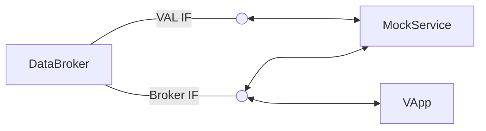

# Mock service

## About

The mock service is a service dummy allowing to control all specified actuators and signals via a configuration file.
## Why

When developing further services or vehicle applications, it can be very useful to be able to mock VSS actuators or sensors without developing a new service. Mock service provides developers with the ability to do just that. Have a look at the complete concept and design ideas [here](./doc/concept.md)

## Component diagram




## Configuration

### Server

| parameter      | default value         | Env var                                                                          | description                     |
|----------------|-----------------------|----------------------------------------------------------------------------------|---------------------------------|
| listen_address | `"127.0.0.1:50053"`   | `MOCK_ADDR`                                                                      | Listen for rpc calls            |
| broker_address | `"127.0.0.1:55555"`   | `"127.0.0.1:$DAPR_GRPC_PORT"` (if DAPR_GRPC_PORT is set)<br>`VDB_ADDRESS` (else) | Connect to data broker instance |
| broker_app_id  | `"vehicledatabroker"` | `VEHICLEDATABROKER_DAPR_APP_ID`                                                  | Connect to data broker instance |

Configuration options have the following priority (highest at top):
1. environment variable
2. default value

## Mock configuration

Mocked datapoint configuration is read from the `mock.py` Python file at runtime. The built container image contains a default configuration for
* `Vehicle.Speed`
* `Vehicle.Cabin.Seat.Row1.Pos1.Position`
* `Vehicle.Body.Windshield.Front.Wiping.System.Mode`
* `Vehicle.Body.Windshield.Front.Wiping.System.TargetPosition`
* `Vehicle.Body.Windshield.Front.Wiping.System.ActualPosition`

This allows the mock service to be used with the [Velocitas Seat Adjuster](https://eclipse.dev/velocitas/docs/about/use_cases/seat_adjuster/) example, as well as the initial [Vehicle App template](https://github.com/eclipse-velocitas/vehicle-app-python-template). Furthermore, it can be used to develop a wiping application for the front wipers.

### Custom mocking configuration
If the mocked datapoints are not enough, the `mock.py` in this repository can be modified and mounted into the mock service container - it will then overwrite the default mock configuration with the custom one.

The full Python mocking DSL can be found [here](./doc/pydoc/mocking-dsl.md)

# Running mockservice

Firstly, you will need to install all necessary Python dependencies by issuing the following command in your favorite terminal:

```bash
python3 -m pip install -r ./requirements.txt
```

To run mock service, use the provided VSCode task `run-mockservice` which will set up all necessary environment variables and parameters for the service to start up properly.

# Generating API documentation

API documentation is generated from Python docs and embedded into markdown files for easy rendering on Github without external hosting. The workflow `ensure-docs-up2date` makes sure that the API docs are up to date before merging a pull request. To update the docs, run

```bash
./update-api-docs.sh
```
