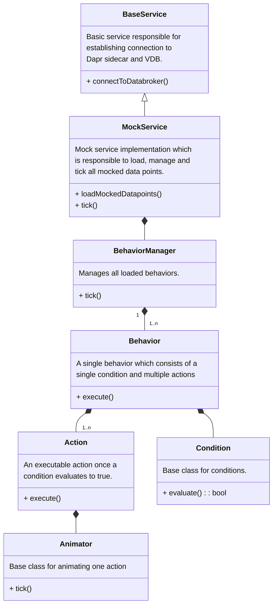

# Concept
## Introduction

As VApp developer I want to have a mock environment where all VSS data points are available and in which actuators will respond when they are requested to change their value.

**Ideally, I should not care about data point availability during development time.**

## Scope

The scope of the Vehicle Mock is a CLI application without a GUI and without phyiscal simulation. It shall be usable to

* configure the mock with expected actuator and sensor behavior to develop an application against
* configure the mock with actions and reactions to use for integration tests

## Functional requirements

| id | version | description |
|:---|:-------:|:-----------|
| #F1  | MVP     | Vehicle Mock shall connect to *Kuksa Data Broker* via gRPC and act as a data provider.
| #F2 | MVP | Vehicle Mock shall be able to accept external configuration for each data point that it is supposed to mock (= mocked data point).
| #F3 | MVP | Mocked data points shall be programmable with predefined behaviors via configuration.
| #F4 | MVP | Mocked data points shall be initializeable with a predefined value via configuration.
| #F5 | MVP | A single mocked data point shall be configurable by its exact path (i.e. `Vehicle.Cabin.Seat.Row1.Pos1.Position`)
| #F6 | post-MVP | A collection of mocked data points shall be configurable by specifing the wild card `*` at a specific sub-branch (i.e. `Vehicle.Cabin.Seat.*`)
| #F7 | MVP | Vehicle Mock shall be able to execute predefined behaviors once a certain condition is met ...
| #F7.1 | MVP | ... a condition evaluates to true
| #F7.2 | MVP | ... an event is received from *Kuksa Data Broker*
| #F8 | MVP | Vehicle Mock shall be able to respond to `actuator_target` requests for all mocked data points, even those without a behavior
| #F8.1 | MVP | if no behavior is available the `actuator_target` request shall be responded to with an immediate setting of the value
| #F9 | MVP | Behaviors shall be able to do the following for one to many data points:
| #F9.1 | MVP | set the value of a single data point to ...
| #F9.1.1 | MVP | ... a static value
| #F9.1.2 | MVP | ... a dynamically resolved value (i.e. the current value of another data point)
| #F9.2 | MVP | animate the value of a single data point to ... (for continuous data types only)
| #F9.2.1 | MVP | ... a static target value
| #F9.2.2 | MVP | ... a dynamically resolved target value (i.e. the current value of another data point)
| #F9.3 | post-MVP | randomly set a single data point ...
| #F9.3.1 | post-MVP | ... within a predefined range
| #F10 | MVP | Animations shall support the following configurable options:
| #F10.1 | MVP | interpolation
| #F10.1.1 | MVP | linear interpolation
| #F10.1.2 | post-MVP | cubic interpolation
| #F10.2 | post-MVP | re-play / looping
| #F10.2.1 | post-MVP | non-looping
| #F10.2.2 | post-MVP | reset after play, play again
| #F10.2.3 | post-MVP | ping-pong (reverse play)
| #F11 | MVP | Values in behavior conditions and target values shall support liteals to indicate the use of dynamic values: `$requested_value` for the requested value of an `actuator_target` event, `$Vehicle.Speed` for dynamic evaluation of the Vehicle's current speed. All VSS sensors and actuators shall be supported in the evaluation of dynamic values.
| #F12 | post-MVP | It shall be possible to re-load the configuration file at runtime via external trigger

## Non-funtional requirements

| id | version | description |
|:---|:-------:|:-----------|
| #NF1 | MVP | External configuration shall be as human readable as possible
| #NF2 | MVP | No GUI is required

## Concept

### Flow

```mermaid
flowchart LR
    ConfigFile[(Config File)]
    ConfigFile-. 2. list of mocked datapoints .->VehicleMock
    DataBroker-. 6. actuator_target request .->VehicleMock
    VehicleMock-. 3. get metadata .-> DataBroker
    DataBroker-. 4. metadata .-> VehicleMock
    VehicleMock-. 5. subscribe mocked datapoints .->DataBroker
    VehicleMock-. 1. read .->ConfigFile
    VehicleMock-. 8. provide datapoint value .->DataBroker
    VehicleMock-. 7. execute behaviors .-> VehicleMock
```

## External Configuration

Different input formats can be supported in the future all of which will require some implementation effort in the mock service. A custom DSL based on YAML was considered at design time, whose concepts are still visible here. It is **not** part of the MVP release in which only a Python-based DSL will be supported. This allows us to stabilize the mocking API interface and settle on an abstraction layer that is easy to use even for users without prior development experience. Based upon this established API, further external configuration formats such as the named YAML, JSON or even [Functional Mock-Up Interface](https://fmi-standard.org/).

### YAML-based configuration (prototype)

The vehicle mock is mainly driven by this configuration file. Anyone shall be able to express a wide range sensor and actuator behaviors without in-depth programming knowledge.

Therefore, we want the configuration to be as human readable as possible.

For a human readable configuration whe choose YAML. JSON has too many braces and quotes, TOML does not require nesting of inner elements and nested elements have to be prefixed, making it unintuitive to read for humans.

Suggested approach: Making the datapoint configuration read as prose text but still keeping all formalities of the markup.

#### Example 1

Prose:

```text
I want to mock the datapoint at path Vehicle.Speed to always return 80
```

Markup:

```yaml
mock_datapoints:
    - at_path: Vehicle.Speed
      initialize_with: 80
```

#### Example 2

Prose:

```text
I want to mock the datapoint at path Vehicle.Cabin.Seat.Row1.Pos1.Position to animate between the current value and the requested actuator_target when an actuator target event is received
```

Markup:

```yaml
mock_datapoints:
  - at_path: Vehicle.Cabin.Seat.Row1.Pos1.Position
    behaviors:
    - if:
        event_received: actuator_target
      then:
        animate:
          to: $requested_value
```

#### Example 3

Prose:

```text
I want to mock the datapoint at path Vehicle.Body.Windshield.Front.Wiping.System.IsWiping to set it to true in case Vehicle.Body.Windshield.Front.Wiping.System.Mode is set to WIPE and Vehicle.Body.Windshield.Front.Wiping.System.ActualPosition does not equal Vehicle.Body.Windshield.Front.Wiping.System.TargetPosition.
```

Markup:

```yaml
mock_datapoints:
    - at_path: Vehicle.Body.Windshield.Front.Wiping.System.IsWiping
      behaviors:
        - if:
            all_true:
                - datapoint: Vehicle.Body.Windshield.Front.Wiping.System.Mode
                  equals: WIPE
                - datapoint: Vehicle.Body.Windshield.Front.Wiping.System.ActualPosition
                  not_equals: $Vehicle.Body.Windshield.Front.Wiping.System.TargetPosition
          then:
            set: true
        - else:
            set: false

```

### Class Diagarm


